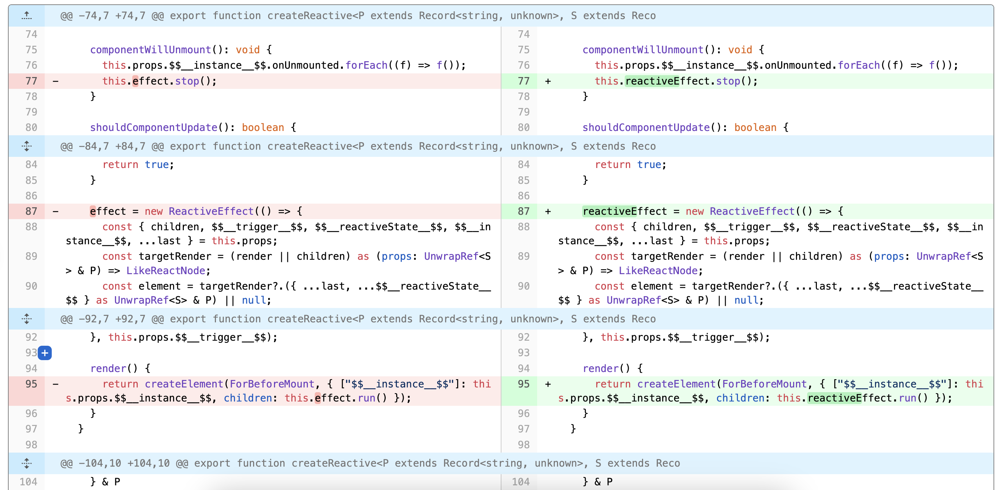
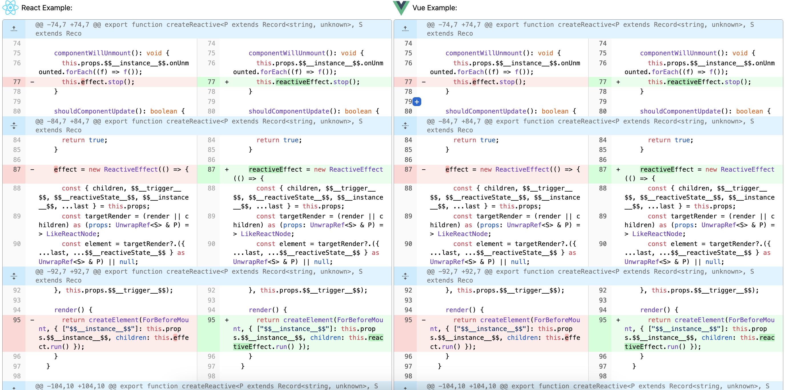
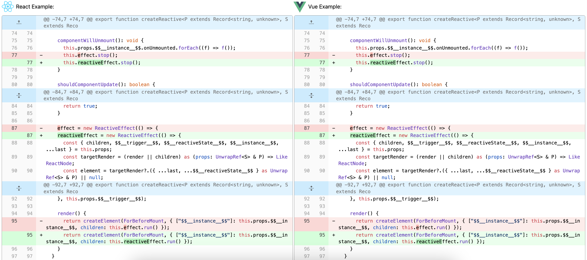

## Git Diff Component

a React/Vue component to show the `git --diff` result, just like Github code review page.

[](https://github.com/MrWangJustToDo/git-diff-view/actions/workflows/deploy.yml)

## Packages

| Package                                  | Version                                                                                                                    |
| :--------------------------------------- | :------------------------------------------------------------------------------------------------------------------------- |
| [`@git-diff-view/core`](packages/core)   | [](https://www.npmjs.com/package/@git-diff-view/core)   |
| [`@git-diff-view/react`](packages/react) | [](https://www.npmjs.com/package/@git-diff-view/react) |
| [`@git-diff-view/vue`](packages/vue)     | [](https://www.npmjs.com/package/@git-diff-view/vue)     |

### syntax highlighter

| Package                                                   | Version                                                                                                                          |
| :-------------------------------------------------------- | :------------------------------------------------------------------------------------------------------------------------------- |
| [`@git-diff-view/lowlight`](packages/lowlight) `build in` | [](https://www.npmjs.com/package/@git-diff-view/lowlight) |
| [`@git-diff-view/shiki`](packages/shiki)                  | [](https://www.npmjs.com/package/@git-diff-view/shiki)       |

## Screen Shot





## Install

```shell
# In React Project
pnpm add @git-diff-view/react

# In Vue Project
pnpm add @git-diff-view/vue


```

## Usage

```tsx
// React

import "@git-diff-view/react/styles/diff-view.css";
import { DiffFile } from "@git-diff-view/React";

<DiffView
  className
  /* return a valid react element to show the widget, this element will render when you click the `addWidget` button in the diff view */

  renderWidgetLine={({ onClose, side, lineNumber }) => jsx.element}
  /* the diff data need to show, type `{ oldFile: {fileName?: string, content?: string}, newFile: {fileName?: string, content?: string}, hunks: string[] }`, you can only pass hunks data, and the component will generate the oldFile and newFile data automatically */

  data={data[v]}
  /* also support the outside `diffFile` to improve performance, so you can use `webWorker` to generate the diff data first, and then pass it to the component */

  diffFile={diffFileInstance}
  /* a list to store the extend data to show in the `Diff View` */
  extendData={extend}
  /* used to render extend data */

  renderExtendLine={({ data }) => jsx.element}
  /* diffView fontSize */

  diffViewFontSize={fontSize}
  /* syntax highlight */

  diffViewHighlight={highlight}
  /* diffView mode: SplitView / UnifiedView */

  diffViewMode={mode}
  /* diffView wrap: code line auto wrap */

  diffViewWrap={wrap}
  /* enable `addWidget` button */

  diffViewAddWidget
  /* when the `addWidget` button clicked */

  onAddWidgetClick
/>;
```

```tsx
// Vue
import "@git-diff-view/vue/styles/diff-view.css";
import { DiffFile } from "@git-diff-view/Vue";

// the usage just like React side, but the `renderWidgetLine` and `renderExtendLine` props become the `widget` / `extend` slots
```

## Development

```shell
# clone this project

# pnpm install

# pnpm run build:packages

# pnpm run dev:react / pnpm run dev:vue

```

## TODO

1. add `diff-match-patch` for better line diff
2. add `virtual scroll` for better performance
